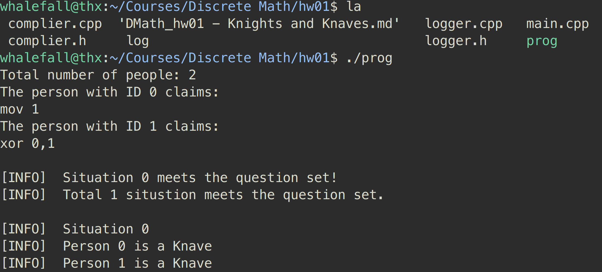
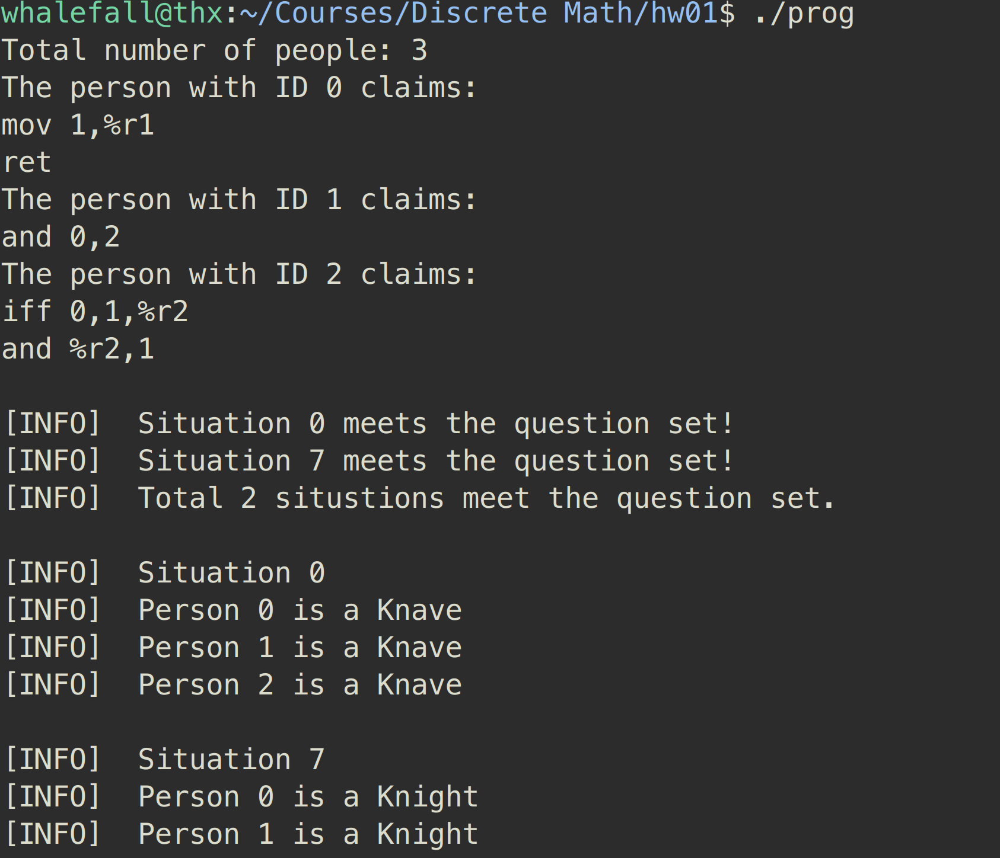
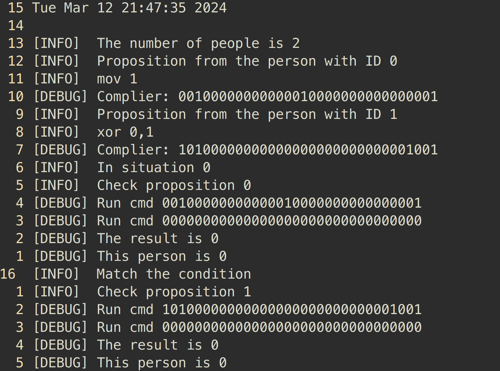

# 离散数学第一次作业

> By 陶浩轩 2023080902011, uploaded to [github](https://github.com/WhaleFall-UESTC/UESTC-Discrete-Math/tree/master/hw01)

<br/>

##  题目

[原题] 一个岛上居住着两类人——骑士和无赖。骑士总是说真话，而无赖永远在撒谎。你碰到两个人A和B。如果A说 “B是骑士”，而B说 “我们两个是两类人”，请问A和B到底是什么样的人？

现在我们将这个题目拓展：同样在这座岛上，不过你遇到了 n 个人，这些人分别提出了一个甚至多个的命题。显然在 n 足够大时，这道题目的解答超出了人力的范围。于是我们需要写一段程序，接受 n 及所有的命题，最终输出所有可能的情况。

<br/>

<br/>

## 初步分析

我们在解决原题时，采取了以下的策略：

1. 列举 A、B 的身份：我们先处理第一种可能的情况：A和B都是流氓
2. 确定了身份设定之后，分析在当前情况下两个人的命题的真值。命题均为假。
3. 检查A和B的行为是否符合他们的身份设定。两人撒谎的行为与流氓身份一致，可以的出A和B都是流氓的情况满足题设。
4. 重复以上步骤，枚举所有可能的身份组合，并对每种情况进行判断和分析，以找出所有满足条件的情况。

这样的解法是非常适合转化成程序的。但是具体实现起来，可以发现两个问题：首先，应该如何设计程序，让计算机能够大量的，高效的列举出 n 个人的所有情况？其次，如何将自然语言的命题转化成计算机可以理解的语言，并且可以让它计算命题在不同条件下的真值？

<br/>

<br/>

## 解决思路

### 1. 枚举所有的情况

在最初学习码制时我就不禁感慨：**二进制数是天然的枚举法**。对于一个 n 位的二进制无符号数，从 0 到 $2^n - 1$ 就遍历了在 n 位上 0 或 1 所有的情况。

```c_cpp
for (int cond = 0; cond < 1 << n; cond ++)
```

`cond` 表示 condition。**我将题目中的 n 个人从 0 到 n 编号，`cond` 的二进制表示中的第 k + 1 位表示编号为 k 的人的身份。我们不妨设骑士为 `1`，流氓为 `0` **。如此一来，便可以轻松地解决枚举问题，并可以用非常简单的方式得知编号为 k 的人的身份：

```c_cpp
(cond >> k) & 1
```

举一个例子：在 `n = 3`，`cond = 6` 时，此时 `cond` 的二进制表示为 `0b110` ，身份的设置便如下表所示：

|编号|身份|
|--|--|
|0|流氓|
|1|骑士|
|2|骑士|

<br/>

### 2. 命题的表示

我设计了一套非常简单的微型“**指令集**”，并为之编写了汇编器（assembler）与模拟器（emulator）。在需要输入命题时，用户可以输入一系列类似于汇编语言的指令。然后汇编器会接收这些指令，并将其转换成“机器码“存储下来。待需要判断命题的真伪时，模拟器会读取相应的机器码并运行，从而计算出命题在当前情况的真值。

#### a. 指令

我一共设计了 8 种指令，并预留了7 个寄存器 `%r1 - %r7`。在下图中，`arg` 表示参数，它可以是编号 k 也可以是寄存器。在具体实现中会传入编号 k 所对应的 0 或 1，或者是寄存器当前存储的值；`reg` 则表示寄存器，运算的结果会存到这里。

|编号|指令|效果|
|--|--|--|
|0|ret|结束执行，并返回当前 %r1 的值|
|1|mov arg,reg|将 arg 的值传送到 reg|
|2|not arg,reg|将 ¬ arg 的值传送到 reg|
|3|and arg1,arg2,reg|将 arg ∧ arg2 的值传送到 reg|
|4|or arg1,arg2,reg|将 arg1 ∨ arg2 的值传送到 reg|
|5|xor arg1,arg2,reg|将 arg1 ⊕ arg2 的值传送到 reg|
|6|imp arg1,arg2,reg|将 arg1 → arg2 的值传送到 reg|
|7|iff arg1,arg2,reg|将 arg1 ↔ arg2 的值传送到 reg|

假如我们要表示这样一个命题：“要么 0 号和 1 号都是骑士，要么 3 号和 5 号是一类人”，那么我们可以输入：

```assembly_x86
and 0,1,%r1
iff 3,5,%r2
or %r1,%r2,%r1
ret
```

当然，在大多情况下，我们更多会遇到像 “ 1 号是流氓”，“ 2 号和 0 号不是一类人” 这样简单的命题。所以我对命令进行了简化：当指令没有给出寄存器时，自动将运算的结果返回。即上述命题可以表达为：

```assembly_x86
not 1
xor 2,0
```

#### b. 机器码

“机器码”本质上是一个 `int` 类型的变量。其中高 3 位编码指令类型（opcode），低 3 位编码寄存器。中间 26 位平分成两个 13 位存储参数（其实不需要那么多，毕竟我设置的 `cond` 是 `long` 型的，最多只能跑 64 个人）。若参数最高位为 0，则代表编号；若为 1 ，则表示寄存器。

<br/>

<br/>

## 运行时图片

#### case 1



#### case 2



#### log



<br/>

<br/>

## 其他

- 编译请用 `g++`

```sh
g++ -O2 -o prog main.cpp complier.cpp logger.cpp
```

- 可以利用文件 `log` debug
